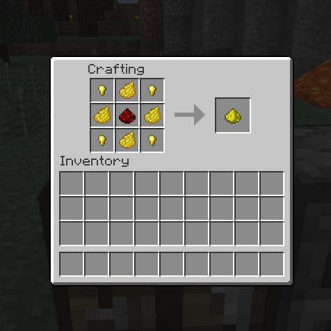
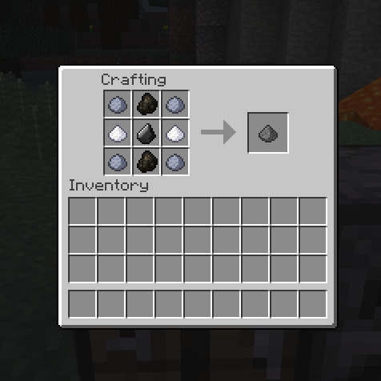
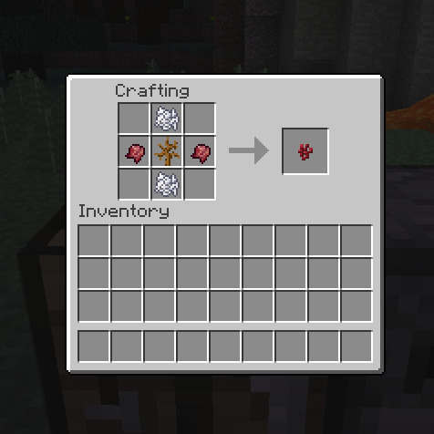
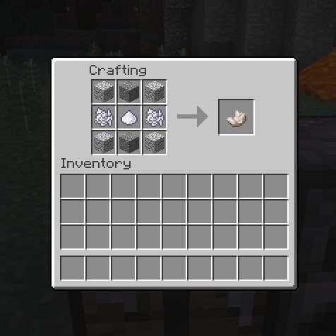
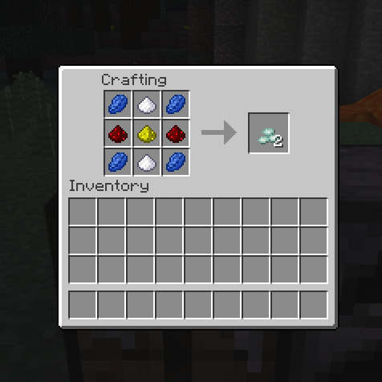
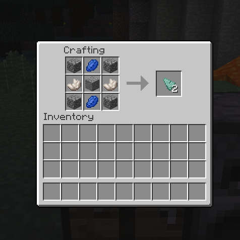

# Helpful Tweaks

Mod for Minecraft to allow crafting and smelting vanilla items.

All options are fully configurable (enable/disable). Take a look into the config file: `helpfultweaks.cfg`.

**Current crafting and smelting recipes**

+ Slime ball
+ Web
+ String
+ Glowstone
+ Gunpowder
+ Nether Wart
+ Nether Quartz
+ Prismarine Crystal (x2)
+ Prismarine Shard (x2)
+ Charcoal
+ Flint
+ Leather

All recipes are available through [Just Enough Items](https://minecraft.curseforge.com/projects/just-enough-items-jei) (JEI).

---

## Crafting

### Slime Ball

### Web

### String

### Glowstone

### Gunpowder

### Nether Wart

### Nether Quartz

### Prismarine Crystal (x2)

### Prismarine Shard (x2)

---

## Smelting

### Charcoal

### Flint

### Leather

---

## License

This software is licensed under the MIT license.

---

## Feedback

Any suggestion is welcome!

