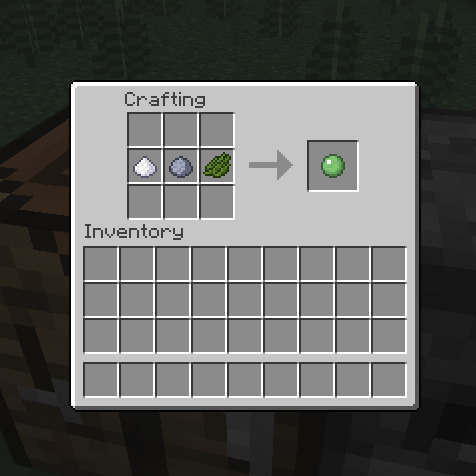
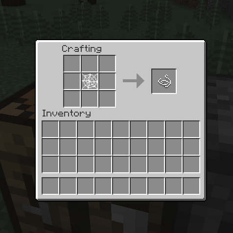
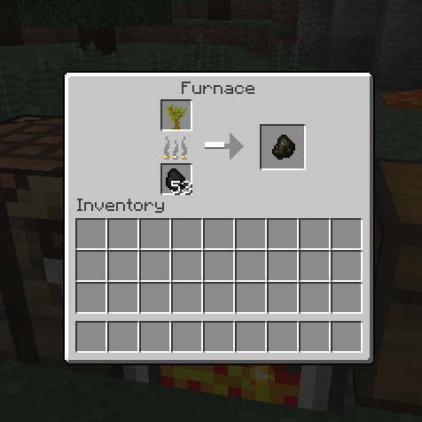
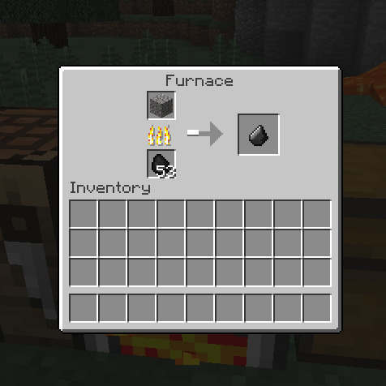
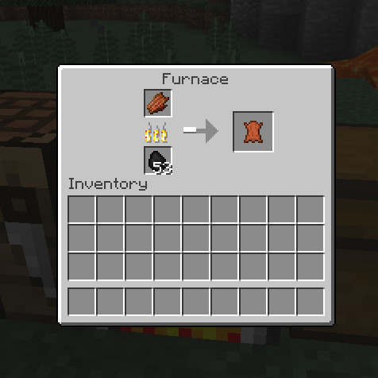

# Helpful Tweaks (MC 1.10.2)

Mod for Minecraft to allow crafting and smelting vanilla items.

All options are fully configurable (enable/disable). Take a look the config file: `helpfultweaks.cfg`.

## Recipes

### Crafting

#### Slime Ball

#### Web

#### String

### Smelting

#### Charcoal

#### Flint

#### Leather

----

## License

This software is licensed under the MIT license.

